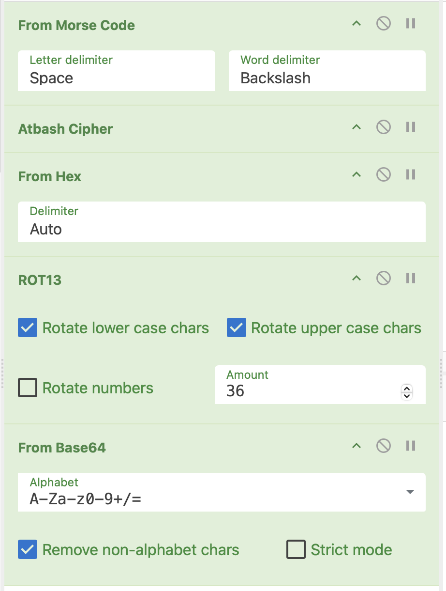

# cat's cake | Easy | crypto

## Информация

> -wiwiwi
> -wawawa
>
> Именно такой разговор подслушал Штирлиц на афтерпати составителей

## Выдать участинкам

[public/ciphertext.txt](public/ciphertext.txt)

## Описание

wiwiwi это dash
wawawa это dot

далее:

и наконец перевернуть текст (ручками или на dcode есть тулза)

## Решение

[solve]()

## Флаг

`cuctf{pupupu_pupupu_pupupu_bruh}`
